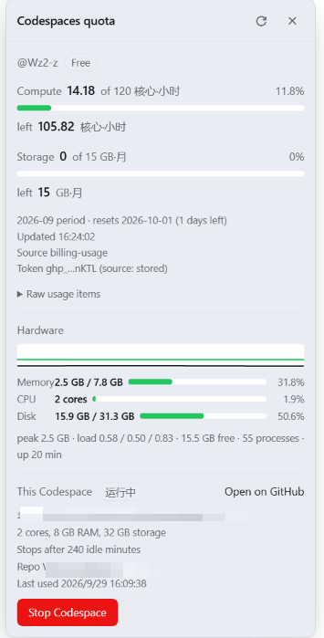

# dsh-codespace-panel

作者：[@Wz2-z](https://github.com/Wz2-z) · 许可：MIT · [English](README.en.md)

在 DSH Web 界面里看 **GitHub Codespaces 额度**、**当前 Codespace 的状态与硬件占用（内存 / CPU / 磁盘）**，并直接**启动 / 停止 / 重启**它。一个 bundle、一行 Host 插件、七个 EXACT 路由。

- **触发按钮**：侧边栏底部、Settings 旁边的电池图标（`sidebar.footer.action`，id `codespace-quota`）；数据加载后展开状态会显示剩余核心·小时数，右上角小圆点按用量变色。
- **弹出面板**：注册在框架级浮层 `shell.overlay`，不会被任何一栏裁剪。
- **Codespace 卡片**（上半）：状态点 + 状态文字 → 机器/存储规格 → 内存 / CPU / 磁盘三条实时占用条（按用量变色）+ 最近约 4 分钟的双线趋势图 → `启动 / 停止 / 重启 / 重建` 四宫格 → 页脚一行「刷新时间 · 进程数 · 运行时长」和 Git 状态（干净 / 有未提交 / 有未推送 + 分支）。
- **额度卡片**（下半）：套餐、本月计算额度（核心·小时）、存储额度（GB·月）、进度条、剩余量、重置日期、原始用量明细。

## 语言

面板跟 **dsh 的语言**走（`ctx.locale.register`）：中文界面与 English 界面都在 `client.js` 里
（`zh` / `en` 两张表），插件列表里的标题与说明来自 `locale/zh.json` 与 `locale/en.json`，
不需要额外开关。

Host 半边回的是错误码（`err_forbidden` / `err_auth` / `err_not_found` …），所有可见措辞都在客户端挑，
这样切语言时连报错文案也跟着换。

## 控制按钮的真实能力

容器一停，DSH 和这个页面就一起结束，所以「从容器内部能做什么」有硬边界：

| 按钮 | 实际行为 |
| --- | --- |
| 启动 | 真的调用 `POST /user/codespaces/{name}/start`；只有在状态是 `Shutdown` 时可用（正常情况下面板只在运行时能打开，所以它基本是灰的） |
| 停止 | 真的调用 `.../stop`，二次确认；停止后额度和这个页面同时结束 |
| 重启 | 先 `.../stop`，再由 Host 在 20 秒后补发一次 `.../start`。停止会把进程一起带走，所以这次启动**可能赶不上**；没赶上就到 github.com/codespaces 点 Start |
| 重建 | **没有 REST 接口**（`gh codespace rebuild` 走的是容器自己的 gRPC 通道），所以这一格是链接：打开编辑器，用命令面板执行「Codespaces: Rebuild Container」 |

## 两套凭据，两种权限

| 功能 | 接口 | 需要什么 |
| --- | --- | --- |
| 额度数字 | [Billing API](https://docs.github.com/en/rest/billing/usage) | **经典 PAT + `user` 权限**（细粒度令牌不支持个人账单接口）。在面板里粘贴即可，写入 DSH 凭据存储的 `codespace-panel/quota-token` 记录（`$DSH_HOME/.credentials.yaml`，0600，不进仓库） |
| 状态 / 停止 | [Codespaces API](https://docs.github.com/en/rest/codespaces/codespaces) | **容器自带的平台令牌**（`/workspaces/.codespaces/shared/` 里那枚，git/gh 用的同一个），**零配置** |

令牌只留在 Host 进程，浏览器永远拿不到；额度令牌按「行配置 `token` → 环境变量（`GITHUB_TOKEN`/`GH_TOKEN`/`CODESPACE_QUOTA_TOKEN`）→ 凭据存储记录 → 旧的明文文件（只读迁移用，保存后自动删除）」取用。本插件不再写任何明文令牌文件。

## 路由（都要自定义请求头 `x-codespace-quota: 1`）

- `GET  /codespace-quota/summary[?refresh=1]` — 额度快照
- `POST /codespace-quota/token` — 保存/清空额度令牌
- `GET  /codespace-quota/codespace` — 当前 Codespace 状态（含机器规格与 git 状态）
- `POST /codespace-quota/stop` — 停止当前 Codespace
- `POST /codespace-quota/start` — 启动当前 Codespace
- `POST /codespace-quota/restart` — 停止 + 20 秒后补一次启动
- `GET  /codespace-quota/resources` — 硬件快照（cgroup + statfs，不经过 GitHub API）

全部是 EXACT 路由：Web 服务器先查 exact 表再查 prefix 表，谁也不会被别人的前缀路由挡住。

每个成功响应都带 `data.version`，值就是本仓库 `package.json` 的 `version`（Host 启动时读取同一目录的 `package.json`），面板标题栏显示为 `v0.2.0`。

## 版本号

版本号的**唯一来源是 `package.json` 的 `version`**，仓库里没有任何第二处硬编码：

- 面板标题栏显示 `v<version>`（Host 在每次成功响应里回传，客户端不自己写死）；
- DSH 插件页显示的就是这个包版本；
- 发版时只改 `package.json` 一处，然后重启 dsh（Host 代码在进程内是缓存的）。

当前：**v0.2.0**。

## 可选配置

写在你自己的 profile `cordis.patch.yml` 对应行里（Host 半边自己校验，未知键会记日志并忽略）：

```yaml
- id: codespace-panel
  name: 'dsh-codespace-panel'
  config:
    includedCoreHours: 180   # 0 = 按套餐自动判断（Free 120 / Pro 180）
    includedStorageGb: 20    # 0 = 按套餐自动判断（Free 15 / Pro 20）
    cacheSeconds: 120
```

## 设计约束（踩过的坑）

1. **只插入一行，而且必须一次装好**：loader 里出现一行激活失败（`inactive`）会破坏其它插件设置表单所依赖的「可配置条目」视图；而 `dsh-remote-web-ui` 的表单每个页面会话只绑定一次，绑坏了就再也不会注册它的侧边栏按钮，直到刷新/重启。第一次安装之所以和它共存无碍，正是因为那次没有失败行。
2. **不导出 `Config` 模式**：改为在 `apply` 里手写归一化，这样本插件不会往 profile 的可配置条目表面添加任何特殊形态。
3. **客户端只在 `sidebar.footer.action` 放一个恒定尺寸的图标**：那一行同时被 `dsh-remote-web-ui` 和 `dsh-cost-meter` 的 CSS 接管布局，尺寸变化或时隐时现都会带动别人的控件。

## 截图



> 侧边栏底部的电池图标展开后的面板：本月额度（核心·小时 / 存储）、硬件占用、当前 Codespace 状态与一键停止。截图中的 Codespace 名与仓库名已打码。
